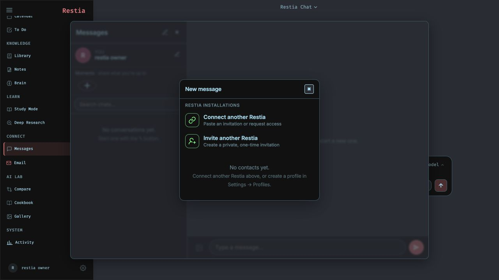

<h1 align="center">Restia</h1>

<p align="center">
  <strong>Your private AI workspace for doing the work, not just discussing it.</strong><br>
  Plan the day, run projects, study deeply, automate routines, and connect your own models and services from one self-hosted app.
</p>

<p align="center">
  <a href="#quick-start">Quick Start</a> ·
  <a href="#whats-new-in-v2">What's New</a> ·
  <a href="docs/setup.md">Setup Guide</a> ·
  <a href="ROADMAP.md">Roadmap</a> ·
  <a href="SECURITY.md">Security</a>
</p>

<p align="center">
  
</p>

Restia is a local-first, self-hosted workspace that connects AI chat, agents,
projects, documents, research, communications, calendar, tasks, and personal
progress. Your database and files stay on infrastructure you control. Network
access happens only for features you enable or use and may include documented
supporting services such as STUN and update checks.

## What's new in V2

V2 turns Restia from a collection of AI tools into an operating system for
your work and learning:

- **Today + Activity** — one Mission Control view for current focus, calendar,
  project work, reminders, study reviews, important mail, goals, and recent
  activity.
- **Projects** — boards and lists, owners/editors/viewers, assignments,
  checklists, comments, completion gates, briefs, evidence, reusable templates,
  and durable task-scoped files. PDF, image, text, Word, Excel, and PowerPoint
  files open safely inside Projects; archives and CAD files keep a private
  local-download fallback.
- **Calendar, Automations + To Do** — capture work quickly, schedule it, choose useful
  reminder timing, and bring the next action back into Today.
- **Progression** — earn XP from verified work, build streaks, complete quests,
  unlock achievements, and level up through real progress rather than clicks.
- **Study** — an AI-linked tutoring workspace with goals, mastery, reviews, and
  a focus clock for deliberate learning.
- **Connect** — email, Telegram, direct messages, owner-to-owner Restia
  invitations, cross-installation Home Link, and peer-to-peer voice/video
  calls. Telegram and Restia connection setup live in the UI; secrets do not
  need to be pasted into shell commands.
- **AI Lab** — compare models, run deep research, manage local models in
  Cookbook, build documents, and extend Restia through tools, MCP, and skills.

The adaptive shell uses a grouped desktop sidebar, a compact icon rail, and a
five-item mobile navigation bar so the same workspace remains usable on a
laptop or phone.

## Quick Start

Docker Compose is the recommended installation path:

```bash
git clone https://github.com/psmithul/restia.git
cd restia
cp .env.example .env
docker compose pull
docker compose up -d --no-build
```

Open [http://localhost:7000](http://localhost:7000). Restia prints the temporary
first-admin password in `docker compose logs`; sign in and change it immediately.

The default bind is loopback-only. Keep it that way unless you intentionally
put Restia behind HTTPS and an authenticated private access layer.

### First five minutes

1. Open **Settings → Models** and connect Ollama, LM Studio, or another
   OpenAI-compatible endpoint.
2. Open **Today** to choose the work that matters now.
3. Create a **Project**, add its definition of done, and attach the evidence as
   tasks move forward.
4. Set your timezone and reminder preferences in **Settings → Reminders**.
5. Connect email, Telegram, calendar, or another Restia installation only if
   you want those capabilities.

Native Linux, Windows, and macOS installation, GPU passthrough, HTTPS, reverse
proxy, provider, and troubleshooting instructions are in the
[complete setup guide](docs/setup.md).

## Workspace Map

| Area | What it is for |
| --- | --- |
| **Home** | Today, Activity, and fast capture |
| **Work** | Projects, Calendar, Automations, To Do, Email, and Notes |
| **Knowledge** | Documents, uploads, memory, and research artifacts |
| **Learn** | Study goals, focus sessions, review, and mastery |
| **Connect** | Messages, Home Link, Telegram, contacts, and calls |
| **AI Lab** | Chat, agents, Compare, Cookbook, Deep Research, and Gallery |
| **System** | Models, integrations, automations, themes, security, and health |

Use <kbd>⌘K</kbd> on macOS or <kbd>Ctrl+K</kbd> elsewhere to jump to a tool,
open a conversation, or capture a note or todo without leaving the current
workspace.

## Models and Providers

Restia is provider-flexible. You can use fully local models, remote APIs, or a
mix of both:

- **Ollama** — the easiest local default.
- **LM Studio** — connect its OpenAI-compatible local server.
- **llama.cpp, vLLM, and compatible gateways** — add their endpoint in
  Settings.
- **Hosted providers** — add credentials only for services you choose to use.

Model calls made by V2 features pass through Restia's shared provider boundary,
so product features do not secretly bypass your configured model routing.
Cookbook can recommend models for the detected hardware, download them, and
manage supported local serving workflows.

## Messages and invitations

Messages are direct conversations between local profiles and between connected
Restia installations, not a built-in support channel.

Any Restia owner can open **Messages → New message → Invite another Restia**
and create a private, single-use invitation. The recipient opens the same menu,
chooses **Connect another Restia**, pastes the invitation, chooses an
installation handle, and explicitly accepts it. The conversation then appears
on both Restia installations; no privileged central contact or approval is
involved.

An owner can also enter another Restia's HTTPS address without a code to send a
connection request. The receiving owner approves or blocks it from Messages.
Invitations contain the sender's reachable Restia origin, expire, and are stored
only as hashes after creation. Internet-separated installations need a reachable
HTTPS address; loopback HTTP is accepted only for local testing.

## Projects and Home Link

Projects are durable workspaces rather than chat attachment buckets. Files are
validated, stored under opaque names, integrity-checked before serving, and
kept separate from temporary chat uploads. Completing a project requires its
active work and checklists to satisfy the definition of done.

Home Link connects two Restia installations without creating a local account
for the remote installation. A project owner explicitly grants **Viewer** or
**Editor** access; viewers can follow work and inspect deliverables, while
editors can update tasks and upload files. Linked file traffic stays behind the
local Restia session, and the remote credential is never exposed to the
browser. See the [setup guide](docs/setup.md) for hub, HTTPS, and TURN details.

**Identity terminology:** One Restia installation is the external Restia
identity that connects to another installation. Password-protected sign-ins
inside an installation are **profiles**, with their own permissions and local
state.

## Privacy and Security

Restia can access sensitive local capabilities: files, shell tools, model
servers, email, calendar, and API credentials. Treat it like an administrator
workspace:

- Keep authentication enabled and replace the temporary admin password.
- Keep the raw app, model, database, search, and notification service ports off
  the public internet.
- Use HTTPS and secure cookies behind a trusted reverse proxy or private access
  gateway.
- Grant integrations only the permissions they need and rotate exposed secrets.
- Back up both the database and durable file directories.

Read [SECURITY.md](SECURITY.md) before a network deployment and report
vulnerabilities through the private process described there.

## Updating and Backups

Updates preserve the configured `data/` and `logs/` directories:

```bash
./update.sh
```

On Windows, run `update_windows.bat`. Published releases use
`ghcr.io/psmithul/restia:latest` plus an immutable version tag. Review the
[backup and restore guide](docs/backup-restore.md) before major upgrades or
storage changes.

## Development

`dev` receives active V2 development; `main` is the more curated branch. For a
local source build, follow the development path in the
[setup guide](docs/setup.md) and run focused tests for the area you change.

Contributions are welcome, especially fresh-install verification, accessibility,
mobile polish, provider compatibility, documentation, and focused reliability
fixes. Start with [CONTRIBUTING.md](CONTRIBUTING.md) and [ROADMAP.md](ROADMAP.md).

## License

AGPL-3.0-or-later. See [LICENSE](LICENSE) and
[ACKNOWLEDGMENTS.md](ACKNOWLEDGMENTS.md).
